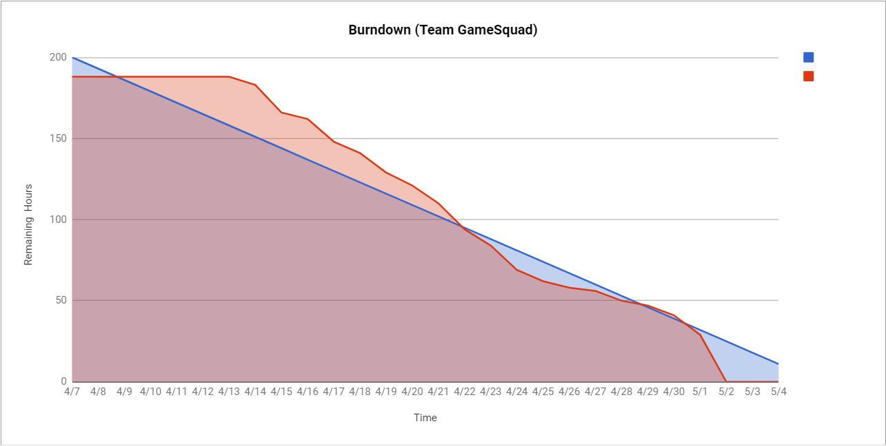

<h1>Team Project Repo</h1> 

<h2>Team</h2>

<h3>Game Squad</h3>

<h2>Team Members</h2>

* <h3>[Marianne Paulson](https://github.com/mariannepaulson/cmpe202)</h3>
* <h3>[Saumil N Patel](https://github.com/saumilnpatel17/cmpe202)</h3>
* <h3>[Anjali Deshmukh](https://github.com/Anjali-Deshmukh/cmpe202)</h3>
* <h3>[Megha Lnu](https://github.com/megha-31/cmpe202)</h3>
* <h3>[Chirag Arora](https://github.com/chiragarora1703/cmpe202)</h3>

<h2>Project Name</h2>

<h3>TurtleWorld</h3>

<h2>Project Description</h2>

We started with a cute turtle game one of us created based on watching Michael Kolling's video series.

https://blogs.kcl.ac.uk/proged/2012/01/14/joc-9/

The initial commit of code is from watching how to create this game and creating it from scratch. We then added counter, custom sounds, and experimented with the Greenfoot UI.

We then refactored the code into patterns taught in class.

Finally, we came up with 10 user stories and implemented all 10 features. We picked two features each.

<h2>Project Progress</h2>

<h3>Project Dashboard</h3>
https://docs.google.com/spreadsheets/d/1mopQ8FHEn-voEusz9E8PlLg993NWcqjp-fM39Le03FU/edit

<h3>Burndown Map</h3>

 

<h3>Advertising our game</h3>

https://www.youtube.com/watch?v=-qXL-YAMdGE

<h3>Individual Contributions</h3>

All team members contributed equally to create mocks, original features for the game, user specifications, accomodating sequence diagrams and presentation. We took turn acting as a scrum master during the project.

- Megha
    - Worked on Decorator pattern for shield which decorates the shield with power to attack snakes
    - Worked on feature point system which controls the levels and scoring of the game
    - Implemented changes to make greenfoot application compatible in Android for wow factor
- Marianne
    - Pitched the idea for this wonderfull game and also worked on our stunning advertisement
    - Worked on observer pattern to update the level in the game
    - Worked on lady bug movement feature which makes ladybug move randomly and over other actors
- Anjali
    - Worked on Composite pattern to add shield with power on turtle. Due to this pattern turtle and shield act like one component and one can add multiple attributes to the turtle as a component
    - Worked on feature Snake Attraction. This enables snake to get attracted towards turtle. If turtle is in its vicinity the snake turns red
    - Converted the mocks from paper to balsamiq mocks
- Chirag
    - Worked on factory pattern to create all actors using multithread and timer. After submitting the create actor request to the queue, the implementation creates actors dynamically
    - Worked on feature 'Game Over' when turtle dies. In this feature when snake eats turtle, game world state is changed to EndWorld state and all the objects are dropped from the world
    - Researched on multiplayer and android application for wow factor
- Saumil
    - Worked on the strategy pattern to add difficulty levels to the game (LOW, MEDIUM, HIGH). These difficulty levels control the speed and count of the snakes in the world
    - Worked on the feature 'Won The Game' which keeps track of levels. Once points reach the maximum threshold, the world transitions to end of game
    - Worked on README enhancements

<h2>Issues</h2>

- We had some issues in editing README and ended up with multiple one liner commits from web
- On merging the branch, the setting to auto delete the branch was used. Due to which branches were deleted.  
- We had setup automatic triggers to update the issues to change its status, but those didn't work. We had to manually close   the issues. But pull requests are their if you want to look at each branches.
- Due to github account getting flagged, Chirag was blocked. We ended up creating duplicate issues with same context. Now account has been reset. We see all the duplicate issues under issues section.
- Due to unclear instructions we are considering project board as Google Task Sheet. 

<h2>Wow Factor</h2>

https://github.com/nguyensjsu/sp19-202-game-squad/tree/wowtry

References: https://github.com/rhildred/droidfoot
